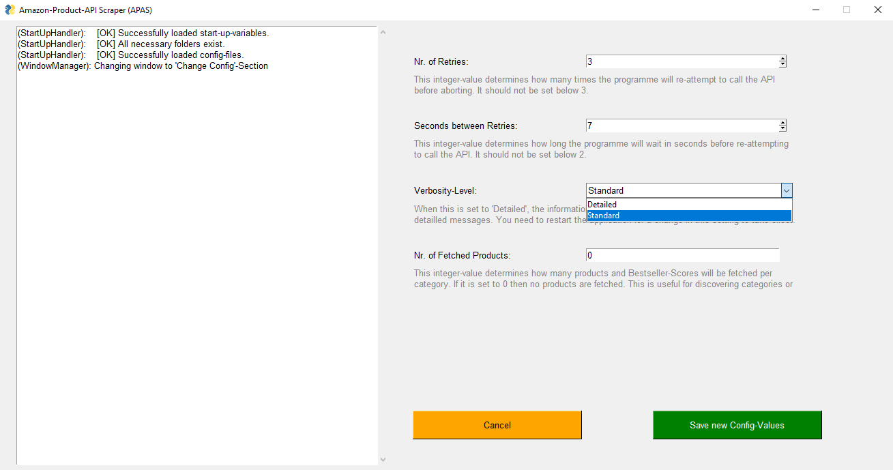
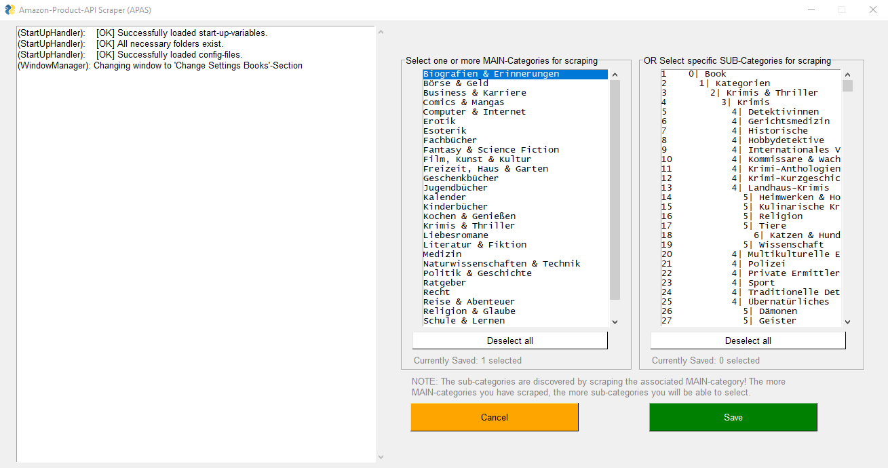
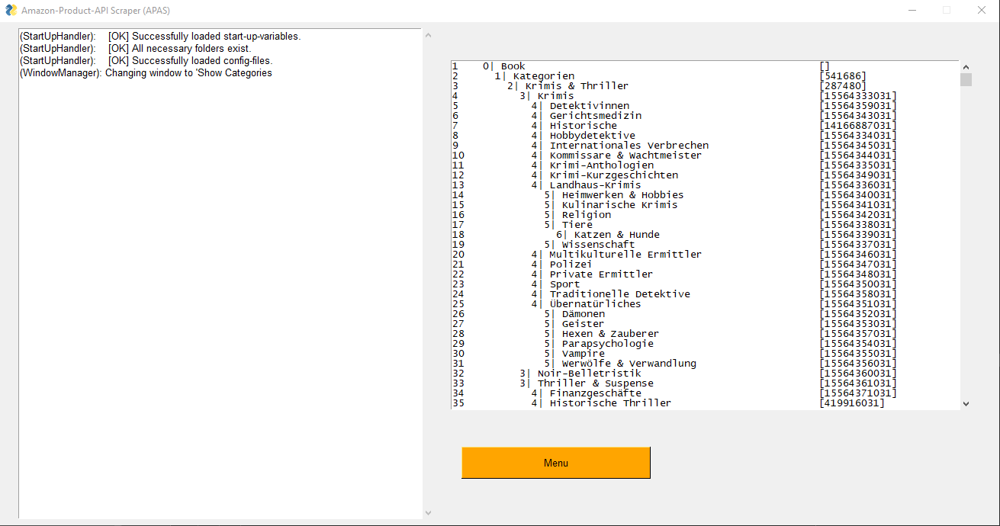

# Amazon-Product-API-Scraper (APAS)
**Automate finding categories with low bestseller-ranking products**

Just select e.g. a book-category and the app will automatically discover all sub-categories and write 
the associated top-products to a csv-file.

A basic GUI-interface simplifies working with the app.

Currently, the app can scrape top products for 
- Amazon books 
- Amazon kindle-e-books.

Currently, the app supports the following Amazon-Marketplaces / Locales:
- Germany (amazon.de)

Sections:
- ["Getting Started (for Users)"](https://github.com/kalvinter/apas#getting-started-for-users)  
- ["Getting Started (for developers)"](https://github.com/kalvinter/apas#getting-started-for-developers)

## Getting Started (for Users)
### Requirements
- Windows Operating System
- Amazon Product API Keys
  * Amazon Product API Access Key
  * Amazon Product API Secret Key
  * Amazon Product API Association Tag


Please visit the [official Amazon-API-documentation](https://docs.aws.amazon.com/de_de/AWSECommerceService/latest/DG/becomingAssociate.html)
for more information on the needed API-Keys.

### Installation

1) Download the repository. In the "dist"-folder you will find the folder "apas". This is the programme. 
Copy this folder to a directory of your choice.

2) Simply run "apas.exe" in the copied "apas"-folder.


### Basic App Layout and Functionality


The App is divided into two columns. The left-hand-output-field shows messages about what the programme is currently
doing. During scraping you can see which category is currently scraped and in case of an error you will find
useful error-messages.

The right-hand-column contains all relevant menus.
In the top you can see three buttons for each supported product-type. 
Each product-type (e.g. books and kindle-e-books) is scraped separately.
1) The green button [starts the scraper](https://github.com/kalvinter/apas#using-the-app).
2) The button "Edit books settings" lets you specify which category or sub-category should be scraped.
3) The button "Show Categories" displays a list of all discovered sub-categories for this product-type.  

In the "General Settings" section you can change your [API-Keys](https://github.com/kalvinter/apas#requirements) or 
change the [main settings](https://github.com/kalvinter/apas#main-settings).

### Automatic Discovery of Sub-Categories
Amazon has an incredible amount of sub-categories.

By default the app only contains all main categories per product type. 
If you scrape a main-category, the algorithm will go through all sub-categories of the 
selected main category until it hits the lowest sub-category. All the sub-categories that are discovered during
this process are saved. Once a sub-category has been discovered, you can select this sub-category directly 
for scraping (see the ['Change product-type-specific settings'-section](https://github.com/kalvinter/apas#change-product-type-specific-settings) for more on category selection). This will save 
you a lot of time if you only need the top products for a specific sub-category.

If you simply want to discover sub-categories, you should set the "Nr. of Fetched Products"-Setting in "Main Settings"
to 0. That way the scraper will only collect sub-categories but not take the extra time to fetch all top-products per sub-category.

All discovered categories can be viewed in the ["Show Categories"](https://github.com/kalvinter/apas#display-all-discovered-sub-categories) menu.

### Main Settings


Here the most basic settings can be changed.  
- **"Nr. of Retries"** specifies the number of times the app will automatically retry a failed API-Call before 
throwing an exception.
- **"Seconds between Retries"** specifies how long the app should wait in seconds before re-attempting a failed API-call. 
The Amazon API is very strict and does not tolerate a lot of API-Calls. This value should ideally be between 4 and 
7 seconds. 
- **"Verbosity-Level"** is mainly used for debugging. On the setting "Detailed" a lot of information will be printed in
the left-hand-message-area of the app.
- **"Nr. of Fetched Products"** determines how many top products are fetched for each scraped sub-category. The maximum 
value is 10. If it is set to 0, no products will be fetched. This is useful if you only want to discover 
all sub-categories because it will significantly reduce the time needed for scraping.

### Change product-type-specific Settings 


In this menu you can select which category/categories should be scraped. The MAIN-categories on the left are all 
top-level categories for this product type. 

On the right side you can alternatively select specific sub-categories for scraping. Due to the insanely large 
number of categories and strict limitations imposed by amazon selecting specific sub-categories should be preferred.

The sub-category-list on the right only includes sub-categories of main categories
that have already been scraped! If you cannot find a specific sub-category you have to scrape it first. More on
this can be found in the section [Automatic Discovery of Sub-Categories](https://github.com/kalvinter/apas#automatic-discovery-of-sub-categories).  

### Display all discovered Sub-Categories


Here all discovered sub-categories are displayed. 
- The numbers on the left indicate the row count. This is useful for finding a specific category in the 
[product-settings](https://github.com/kalvinter/apas#change-product-type-specific-settings).
- The number right before the category name (e.g. 2|) indicates the category's level. All categories with the
level 2 can be directly found and selected in the product-specific-settings. All lower categories have to be discovered
during scraping.
- The number on the right in square brackets (e.g. [541686]) are the node-ids of the respective category.

### Using the App
1) Enter you Amazon-API-Credentials when prompted (see [Requirements](https://github.com/kalvinter/apas#requirements))
2) Go to e.g. "Change Books Settings" and select a main category for scraping. Click on save.
3) Click on "Run 'Books' Scraper" to start the scraper.
4) Wait until its finished. You will find the created CSV-Files with all top-products in the "csv_output"-folder.

### Troubleshooting
- ERROR-Message: _"ERROR: Could not initialize Amazon-API-Connection! ..."_: Please make sure that you have entered 
your API-keys correctly! You can change them by clicking on "Change API-Secrets".
- ERROR-Message: _"ERROR: Could not reach API after X seconds"_:Increase the time between retries in main settings. 
A value between 4 and 7 seconds should suffice.
- ERROR-Message: _"ERROR: An error occurred while trying to sort the product-list. ..."_ This error message is normal 
if you have set the "Nr of Fetched Products" to 0. If you get this message while "Nr of Fetched Products" is larger 
than 0, please open an issue on github.


## Getting Started (for Developers)
### Requirements & Tested Platforms
- Python 3.7+
- Windows 10
- Amazon Product API Keys
  * Amazon Product API Access Key
  * Amazon Product API Secret Key
  * Amazon Product API Association Tag

Please visit the [official Amazon-API-documentation](https://docs.aws.amazon.com/de_de/AWSECommerceService/latest/DG/becomingAssociate.html)
for more information on the needed API-Keys. 

### Installation
Download the repository and install all dependencies.

There is a PipFile as well as a requirements.txt-File located in the root-directory.

You can either install all dependencies via pipenv:
```` 
pipenv install
````
or you can just install the dependencies directly from the requirements.txt-file via pip.

````
pip install -r requirements.txt 
````

### Usage
Just run the main script located in the root directory
````
python cli.py 
````

### Building an Executable
Run pyinstaller with --onedir option. When using the --onfile option in combination with -w the app does not start properly.

```` 
pyinstaller --name="apas" --onedir --log-level="DEBUG" -w cli.py
````

Currently only tested for Windows 10.

## Built With
- [PySimpleGUI](https://github.com/PySimpleGUI/PySimpleGUI) - for the graphical user interface
- [python-amazon-simple-product-api](https://github.com/yoavaviram/python-amazon-simple-product-api) - 
for interacting with the Amazon API
- [PyInstaller](http://www.pyinstaller.org/) - for creating an executable

## License
This project is licensed under the MIT License - see the LICENSE.md file for details
